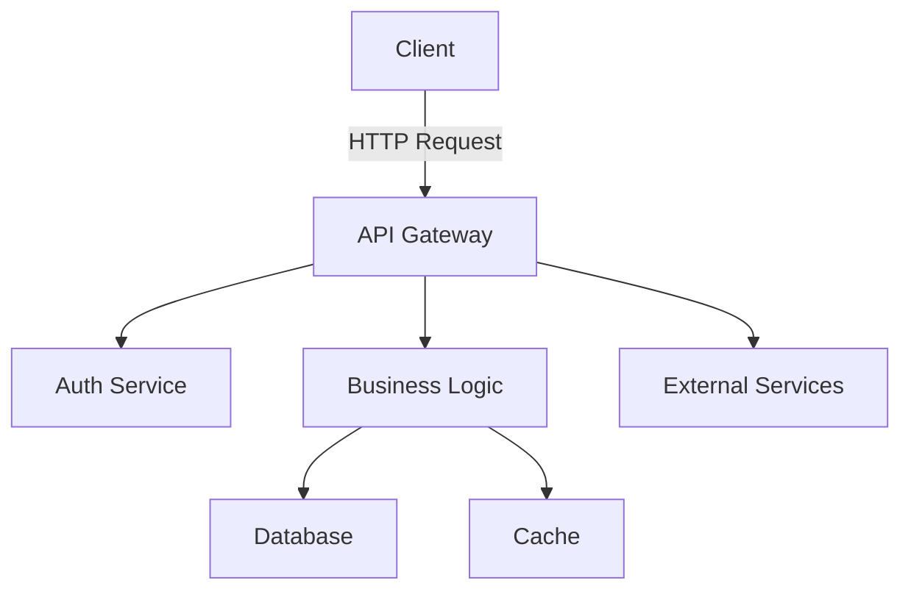

# Create Architecture Documentation

You are tasked with creating comprehensive architecture documentation for this project.

## Documentation Scope

Create documentation that covers:

### 1. System Overview
- Project purpose and goals
- Key features and capabilities
- Target users and use cases
- Technology stack summary

### 2. Architecture Diagrams
- High-level system architecture
- Component relationships and data flow
- Database schema (if applicable)
- API structure (if applicable)
- Deployment architecture

### 3. Component Documentation
For each major component:
- Purpose and responsibility
- Key interfaces and dependencies
- Data models and schemas
- Important algorithms or business logic
- Configuration options

### 4. Technical Decisions
Document key architectural decisions:
- Technology choices and rationale
- Design patterns used
- Trade-offs considered
- Alternatives evaluated

### 5. Data Flow
- Request/response flow
- Data persistence strategy
- Caching strategy (if applicable)
- External service integrations

### 6. Security Architecture
- Authentication mechanism
- Authorization approach
- Data protection measures
- Security considerations

### 7. Scalability & Performance
- Performance characteristics
- Scalability approach
- Bottlenecks and limitations
- Future scaling considerations

### 8. Development Guidelines
- Code organization principles
- Module boundaries
- Testing strategy
- Development workflow

## Process

1. **Analyze the codebase** thoroughly to understand:
   - Project structure and organization
   - Main components and their relationships
   - Technologies and frameworks used
   - Data models and APIs

2. **Create architecture documentation** in `docs/architecture/`:
   - `README.md` - Overview and table of contents
   - `system-overview.md` - High-level system description
   - `components.md` - Detailed component documentation
   - `data-architecture.md` - Database and data flow
   - `api-architecture.md` - API structure (if applicable)
   - `security.md` - Security architecture
   - `deployment.md` - Deployment architecture
   - `decisions.md` - Architecture Decision Records (ADRs)

3. **Use diagrams** where helpful:
   - Mermaid diagrams for system architecture
   - Entity-relationship diagrams for databases
   - Sequence diagrams for complex flows

4. **Keep it practical**:
   - Focus on what exists, not what's planned
   - Include code examples where relevant
   - Link to relevant source files
   - Make it useful for developers joining the project

## Output Format

Structure documentation using clear markdown with:
- Table of contents for easy navigation
- Headings for sections
- Code blocks with syntax highlighting
- Mermaid diagrams for visual representation
- Links to source code files
- Examples and use cases

## Example Mermaid Diagram

Begin by analyzing the project structure and then create comprehensive architecture documentation.
